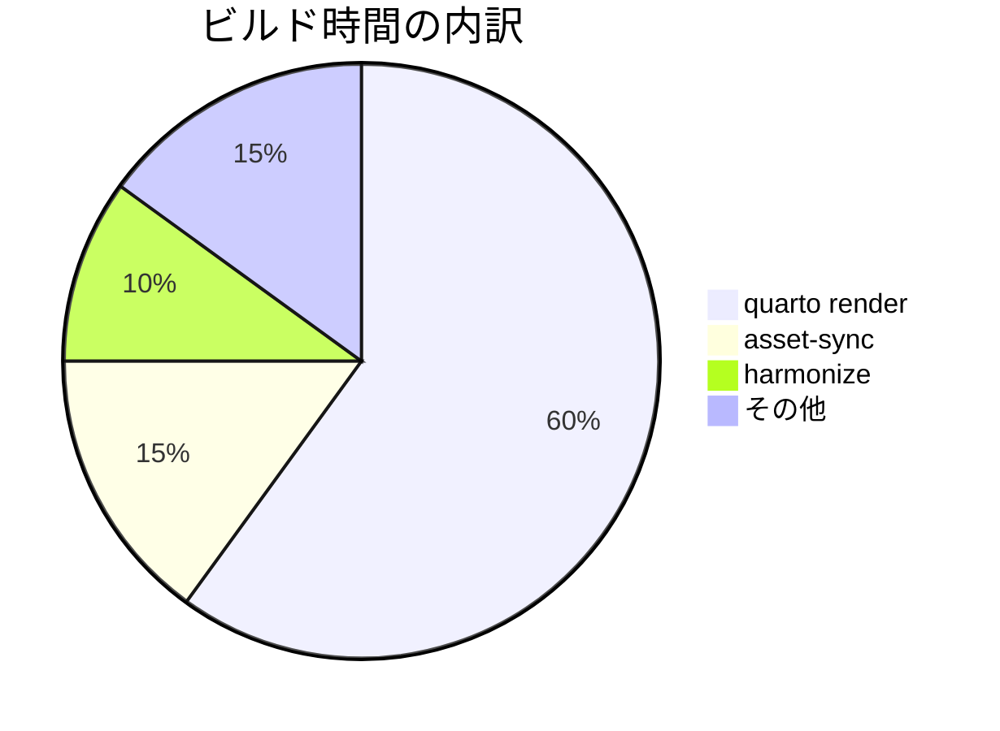

調査・計測の結果を客観的に残すためのページです。

## 背景

- ビルド時間が 3 分を超え、開発フィードバックが遅くなっている
- どの工程がボトルネックかを定量化する

## 結果

`quarto render` が全体の 60% を占めることが分かりました。

| 工程 | 所要時間 | 割合 |
|---|---|---|
| quarto render | 120s | 60% |
| asset-sync | 30s | 15% |
| harmonize | 20s | 10% |
| その他 | 30s | 15% |

## 考察

- quarto render はキャッシュ機構を導入すれば半減が見込める
- asset-sync は変更がない場合のスキップ判定を入れると短縮できる

## まとめ

- ボトルネックは quarto render のため、まずキャッシュ化を検討する
- 効果測定は次回リリース後に行う

## 関連

- [設計メモ](design-doc.html)
- [テンプレートカタログ](../index.html)
